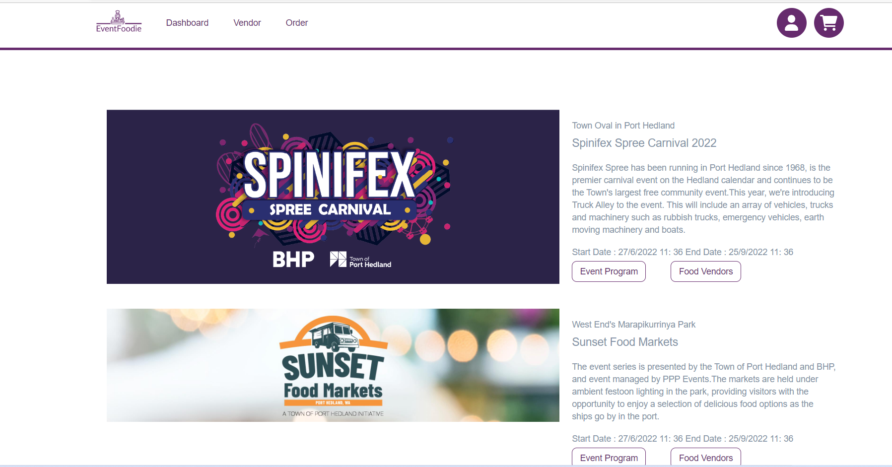
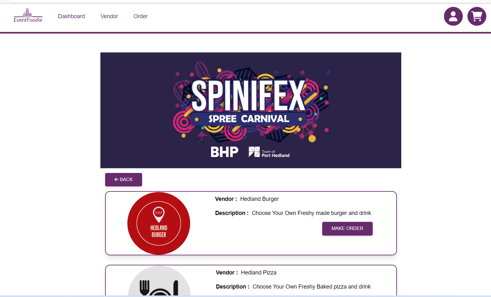
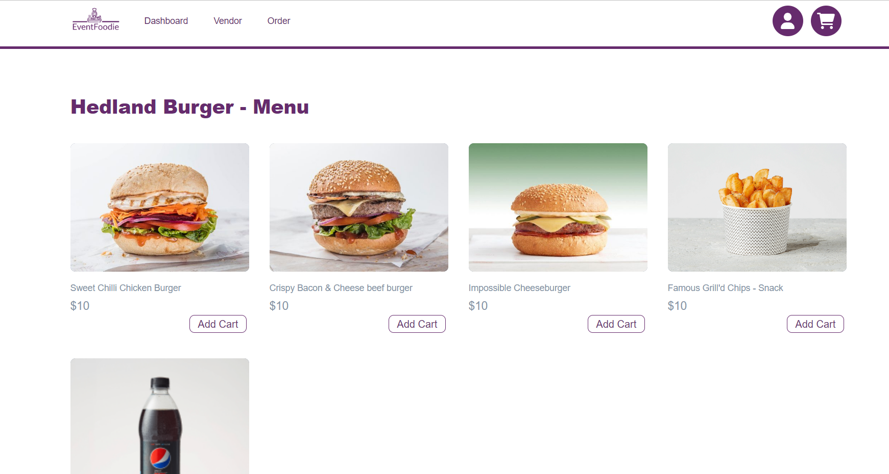
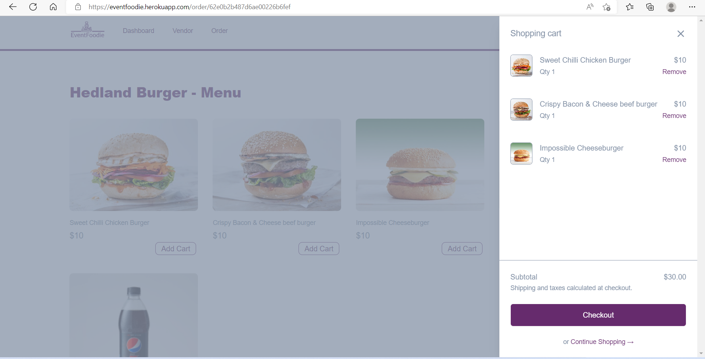
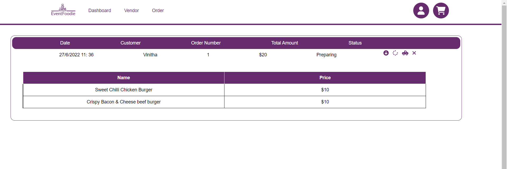
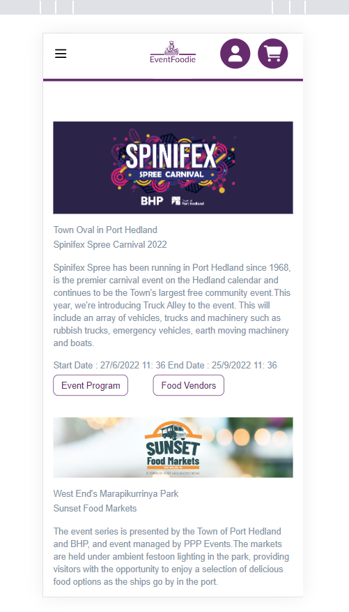
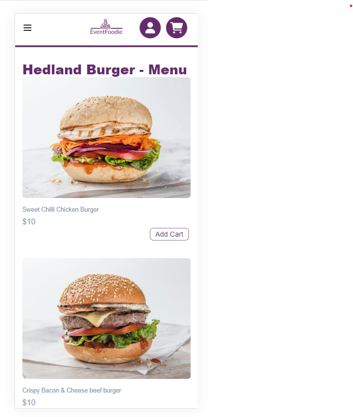

# EventFoodie
## Table of Contents

- [Description](#description)
- [Installation](#installation)
- [Usage](#usage)
- [Login](#login)
- [Image](#image)
- [Repository](#repository)
- [Production](#production)
- [Contributing](#contributing)
- [Questions](#questions)

## Description

 This app is very helpfull for the public to spend their leasure time with families and friends rather than spending time standing in the que to order food.This app enables public to view the events comming up ,view program of the event,view food vendors,view their menu and order food.This app is helpfull to track the order.The update of the order is sent to customer's mobile via text message.

## Installation

`npm init`

`npm i`

`npm run install`

`npm run seed`

## Usage

Run the following command at th root of your project and check the app

`npm run develop`

## Login

Public user type login detail
username : vini@gmail.com
password : 123456

Vendor type login detail
username : kayal@gmail.com  
password : 123456

## Contributing

[Vinitha Gowtheepan](https://github.com/sreevinithaa)

## Image

## Repository

You can get the code in the following link. https://github.com/sreevinithaa/EventFoodie.git

## Production

You can check the app in following link. https://eventfoodie.herokuapp.com/

## Questions

Contact me with any questions: [email](mailto:sreevinithaa@gmail.com) , [GitHub](https://github.com/sreevinithaa) 

